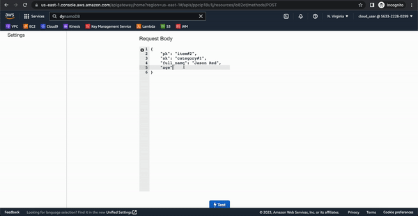
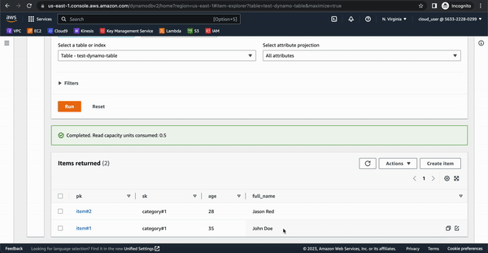
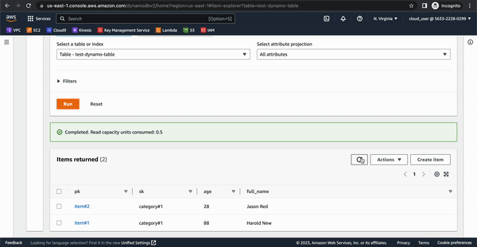
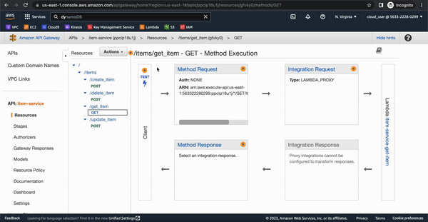

# item-service

This project contains source code and supporting files for a CRUD (create, read, update, delete) serverless application that you can deploy with the SAM CLI. It includes the following files and folders.

## /create_item - Create a new item in Dynamo DB.

## /update_item - Update an existing item in Dynamo DB.

## /delete_item - Delete an existing item in Dynamo DB.

## /get_item - Get an existing item in Dynamo DB.

- events - Invocation events that you can use to invoke the function.
- tests - Unit tests for the application code. 
- template.yaml - A template that defines the application's AWS resources.

The application uses several AWS resources, including Lambda functions and an API Gateway API. These resources are defined in the `template.yaml` file in this project. You can update the template to add AWS resources through the same deployment process that updates your application code.

## Deploy the sample application
You need the AWS CLI and you need to ensure you configure your account with: 
```
aws configure
```
To use the SAM CLI, you need the following tools.

* SAM CLI - [Install the SAM CLI](https://docs.aws.amazon.com/serverless-application-model/latest/developerguide/serverless-sam-cli-install.html)
To build and deploy your application:

```
sam build && sam deploy
```

## Unit tests

Tests are defined in the `tests` folder in this project. Use PIP to install the [pytest](https://docs.pytest.org/en/latest/) and run unit tests.

```bash
item-service$ pip install pytest pytest-mock --user
item-service$ python -m pytest tests/ -v
```

## Resources

See the [AWS SAM developer guide](https://docs.aws.amazon.com/serverless-application-model/latest/developerguide/what-is-sam.html) for an introduction to SAM specification, the SAM CLI, and serverless application concepts.

